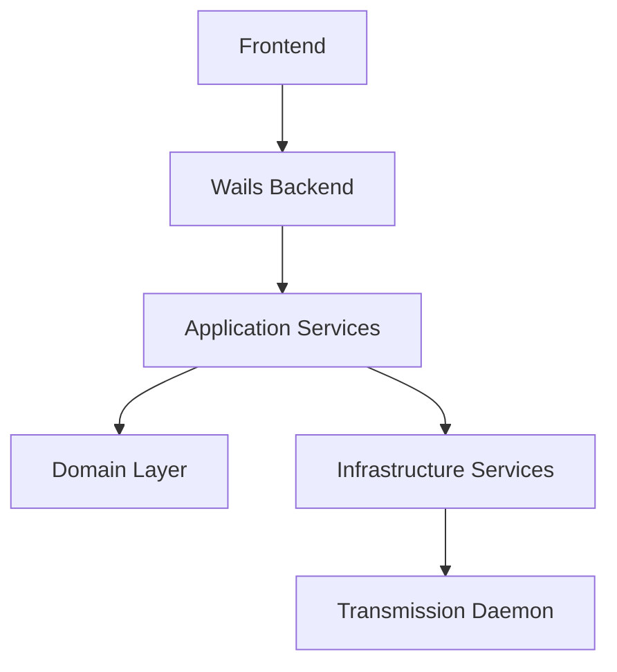

# Application Architecture

## Clean Architecture Overview
The application follows Clean Architecture principles, organizing code into concentric layers with dependencies pointing inward.

## Layer Details

### 1. Domain Layer (`internal/domain/`)
- Contains core business logic and entities
- Defines interfaces for repositories
- Key components:
  - `torrent.go`: Core torrent entity and status types
  - `config.go`: Configuration domain model

### 2. Application Layer (`internal/application/`)
- Implements use cases
- Orchestrates flow of data
- Key components:
  - `torrent_service.go`: Business logic for torrent operations

### 3. Infrastructure Layer (`internal/infrastructure/`)
- External services integration
- Implementation of interfaces defined in domain layer
- Key components:
  - `transmission_client.go`: Transmission daemon communication
  - `config_service.go`: Configuration management
  - `encryption_service.go`: Security services

### 4. Presentation Layer (`frontend/`)
- React-based user interface
- Components structure:
  - `App.tsx`: Main application component
  - `components/`: Reusable UI components
  - `styles/`: CSS modules for styling

## Data Flow
1. UI events trigger actions
2. Actions are handled by Wails backend
3. Services process the requests
4. Data flows through the layers respecting dependency rules
5. Results are returned to UI

## Security
- Credentials stored securely in system keyring
- HTTPS support for daemon communication
- Encryption for sensitive data

## Communication
