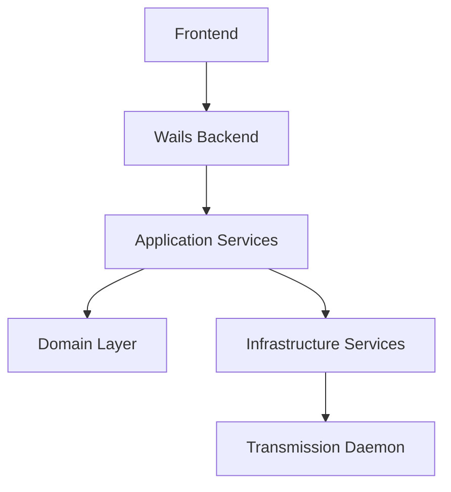

# Архитектура приложения

## Обзор Clean Architecture
Приложение следует принципам Clean Architecture, организуя код в концентрические слои с зависимостями, направленными внутрь.

## Детали слоёв

### 1. Domain Layer (`internal/domain/`)
- Содержит основную бизнес-логику и сущности
- Определяет интерфейсы для репозиториев
- Ключевые компоненты:
  - `torrent.go`: Основная сущность торрента и типы статусов
  - `config.go`: Доменная модель конфигурации

### 2. Application Layer (`internal/application/`)
- Реализует сценарии использования
- Оркестрирует поток данных
- Ключевые компоненты:
  - `torrent_service.go`: Бизнес-логика для операций с торрентами

### 3. Infrastructure Layer (`internal/infrastructure/`)
- Интеграция с внешними сервисами
- Реализация интерфейсов, определенных в domain layer
- Ключевые компоненты:
  - `transmission_client.go`: Взаимодействие с демоном Transmission
  - `config_service.go`: Управление конфигурацией
  - `encryption_service.go`: Сервисы безопасности

### 4. Presentation Layer (`frontend/`)
- Пользовательский интерфейс на React
- Структура компонентов:
  - `App.tsx`: Основной компонент приложения
  - `components/`: Переиспользуемые UI компоненты
  - `styles/`: CSS модули для стилизации

## Поток данных
1. События UI запускают действия
2. Действия обрабатываются бэкендом Wails
3. Сервисы обрабатывают запросы
4. Данные проходят через слои с соблюдением правил зависимостей
5. Результаты возвращаются в UI

## Безопасность
- Учетные данные хранятся безопасно в системном keyring
- Поддержка HTTPS для взаимодействия с демоном
- Шифрование для чувствительных данных

## Схема взаимодействия
