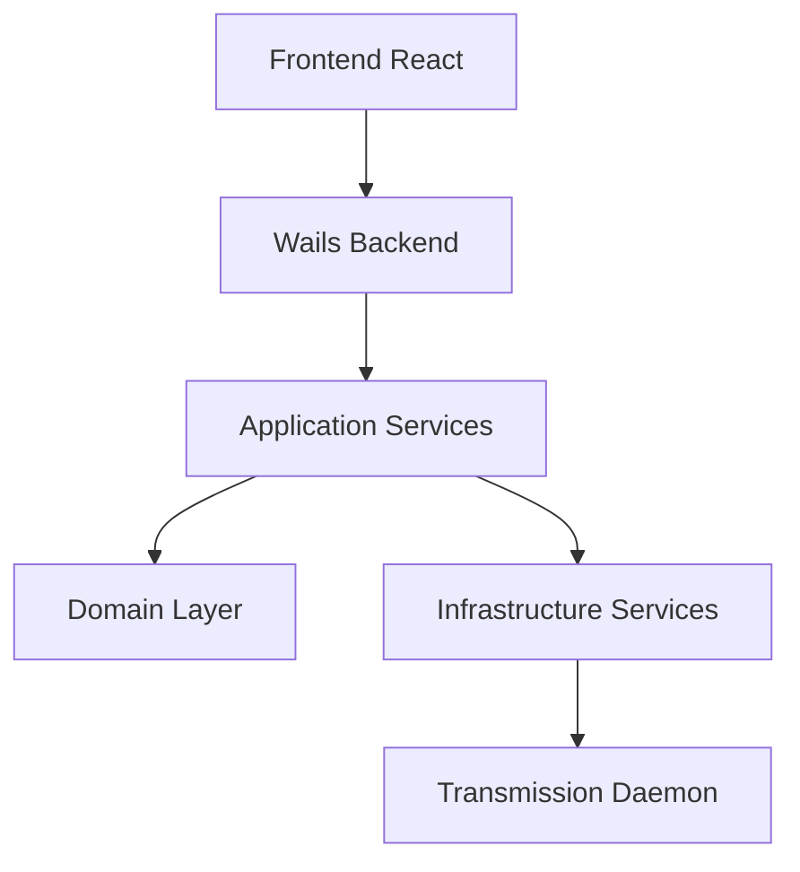

# Архитектура приложения

## Обзор Чистой Архитектуры

Приложение следует принципам Чистой Архитектуры, организуя код в концентрические слои с зависимостями, направленными внутрь. Это обеспечивает:

- Независимость бизнес-логики от внешних фреймворков и библиотек
- Лёгкую тестируемость
- Гибкость при замене компонентов
- Четкое разделение ответственности

## Детали слоев

### 1. Domain Layer (`internal/domain/`)

- Содержит основную бизнес-логику и сущности
- Определяет интерфейсы для репозиториев
- Ключевые компоненты:
  - `torrent.go`: Основная сущность торрента и типы статусов
  - `config.go`: Модель конфигурации домена
  - `session_stats.go`: Статистика сессии Transmission

Пример определения сущности торрента:
```go
type Torrent struct {
    ID                     int64
    Name                   string
    Status                 TorrentStatus
    Progress               float64
    Size                   int64
    SizeFormatted          string
    // ... другие поля
}
```

### 2. Application Layer (`internal/application/`)

- Реализует варианты использования (use cases)
- Оркестрирует поток данных
- Ключевые компоненты:
  - `torrent_service.go`: Бизнес-логика для операций с торрентами

Сервисы используют интерфейсы, определенные в Domain Layer:
```go
type TorrentService struct {
    repo domain.TorrentRepository
}

func (s *TorrentService) GetAllTorrents() ([]domain.Torrent, error) {
    return s.repo.GetAll()
}
```

### 3. Infrastructure Layer (`internal/infrastructure/`)

- Интеграция с внешними сервисами
- Реализация интерфейсов, определенных в Domain Layer
- Ключевые компоненты:
  - `transmission_client.go`: Коммуникация с демоном Transmission
  - `config_service.go`: Управление конфигурацией
  - `encryption_service.go`: Службы безопасности
  - `localization_service.go`: Управление локализацией

В этом слое используются конкретные библиотеки и фреймворки:
```go
type TransmissionClient struct {
    client *transmissionrpc.Client
    ctx    context.Context
}
```

### 4. Presentation Layer

#### Backend presentation (`app.go`)
- Связывает Go-бэкенд с фронтендом через Wails
- Экспортирует методы для использования в UI
- Обрабатывает файловые ассоциации и системные события

#### Frontend presentation (`frontend/`)
- React-интерфейс пользователя
- Структура компонентов:
  - `App.tsx`: Основной компонент приложения
  - `components/`: Переиспользуемые UI-компоненты
  - `contexts/`: Контексты React для управления состоянием
  - `hooks/`: Пользовательские хуки React
  - `styles/`: CSS-модули для стилизации

## Потоки данных

### Стандартный поток данных:
1. События UI запускают действия
2. Действия обрабатываются бэкендом Wails
3. Сервисы обрабатывают запросы
4. Данные проходят через слои, соблюдая правила зависимостей
5. Результаты возвращаются в UI

### Поток добавления торрента:
1. Пользователь добавляет торрент через UI или внешний файл
2. Frontend вызывает метод бэкенда (`AddTorrent` или `AddTorrentFile`)
3. Бэкенд передает запрос в сервис торрентов
4. Сервис торрентов использует репозиторий для взаимодействия с Transmission
5. Transmission добавляет торрент и возвращает результат
6. Результат проходит обратно через слои к UI

## Безопасность

- Учетные данные хранятся безопасно в системном хранилище ключей
- Поддержка HTTPS для взаимодействия с демоном
- Шифрование для чувствительных данных

## Коммуникация между компонентами



## Управление состоянием во Frontend

Приложение использует React Context для управления состоянием:

1. **LocalizationContext**: Управление языками и переводами
2. **ThemeContext**: Управление переключением темы
3. **Пользовательские хуки**:
   - `useTorrentData`: Для загрузки и обновления данных о торрентах
   - `useBulkOperations`: Для выполнения операций над несколькими торрентами

## Локализация

Локализация реализована с помощью JSON-файлов в директории `locales/`:

```
locales/
  ├── en.json
  └── ru.json
```

Сервис локализации в Infrastructure Layer загружает соответствующие переводы, которые затем используются в UI.

## Стилизация и темы

Приложение использует CSS Modules для модульных стилей и поддерживает темы:

```
frontend/src/styles/
  ├── App.module.css
  ├── Header.module.css
  ├── theme.css
  ├── TorrentItem.module.css
  └── TorrentList.module.css
```

Все цветовые переменные определены в `theme.css` и используются во всем приложении.

## Файловые ассоциации

Файловые ассоциации настроены в `wails.json` и обрабатываются системными обработчиками:

- В macOS через `OnFileOpen` в конфигурации Wails
- Через метод `handleFileOpen` в `app.go`